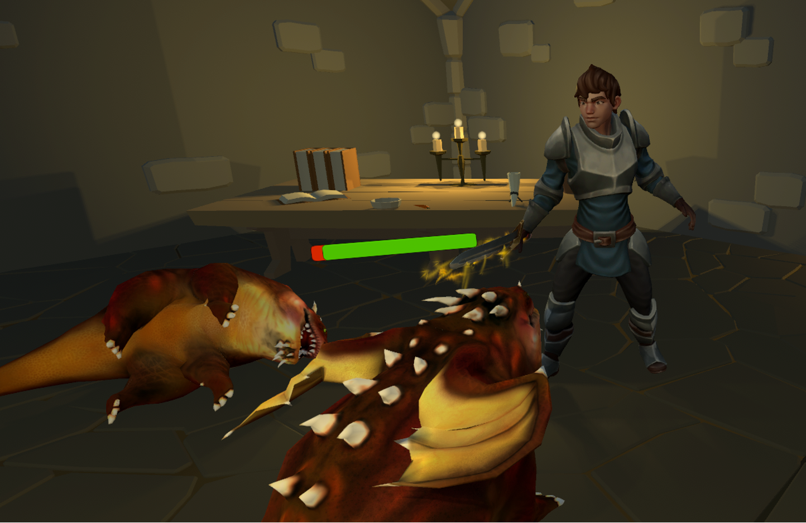

# Spieleprogrammierung und 3D-Animation Projekt

### Autoren: Patrick Felschen & Julian Voß

#

## Prinzip

- Spieler soll End-Drachen erledigen
- Vorbereitung:
  - Erledigen von Gegnern, um Punkte zum Verbessern zu bekommen
  - Sammeln von Kisten, um im Kampf Lebenspunkte zurück zu gewinnen
- Herausforderung:
  - Orientierung: Räume sehen alle ähnlich aus
  - Gegner werden immer stärker

## Funktionen

- Labyrinth Generierung
  - Verschiedene Räume mit gleichem Layout
  - Zufälliger Inhalt der Räume
  - Nach dem Generieren: Erzeugung eines NavMeshes
  - Platzierung der Gegner
- Kampf System
  - Attackieren: Gegner erhält schaden
  - Blocken: Zugefügter Schaden wird verringert
  - Damage Anzeige bei Attacke
- Gegner
  - Patrouilliert in seinem Bereich
  - Verfolgung bei Annäherung
  - Angriff beim Erfassen
  - Leben des Gegners wird in einer Bar angezeigt
- Skill System
  - Charakter hat verschiedene Werte
  - Punkte können für Aufwertungen ausgegeben werden
  - Normaler Gegner gibt einen Aufwertungspunkt
  - Boss gibt 10 Aufwertungspunkte
  - Bei Tod Verlust der Aufwertungen
- Kisten
  - Räume haben Chance Kiste(n) zu spawnen
  - Spieler kann per Interaktion Kiste plündern
  - Items werden in Inventar des Spieler abgelegt (Heilung)

## Steuerung

- Maus Bewegung: Steuerung Kamera
- Maus Taste links: Angreifen
- Maus Taste rechts: Block
- W, A, S, D: Bewegung des Spielers
- Shift: Sprinten
- E: Interaktion mit Gegenständen
- Q: Heilung
- ESC: Öffnen des Menüs

## 3D Assets

- BrokenVector
  https://assetstore.unity.com/packages/3d/environments/dungeons/ultimate-low-poly-dungeon-143535
- Cartoon Heroes
- Dungeon Skeletons Demo https://assetstore.unity.com/packages/3d/characters/creatures/dungeon-skeletons-demo-71087
- UI SciFi Icons https://assetstore.unity.com/packages/2d/gui/icons/ui-scifi-icons-110990
- Dragon for Boss Monster : HP https://assetstore.unity.com/packages/3d/characters/creatures/dragon-for-boss-monster-hp-79398
- Medieval Cartoon Warriors https://assetstore.unity.com/packages/3d/characters/medieval-cartoon-warriors-90079

## Sound Assets

- 25 Fantasy RPG Game Tracks Music Pack https://assetstore.unity.com/packages/audio/music/25-fantasy-rpg-game-tracks-music-pack-240154
- RPG Essentials Sound Effects - FREE! https://assetstore.unity.com/packages/audio/sound-fx/rpg-essentials-sound-effects-free-227708
- Sound Effects https://pixabay.com/de/sound-effects/search/sound/

## Tutorial Inspiration

- RANDOM DUNGEON GENERATOR - EASY UNITY TUTORIAL - #1 https://www.youtube.com/watch?v=qAf9axsyijY
- RANDOM DUNGEON GENERATION - EASY UNITY TUTORIAL - #2 https://www.youtube.com/watch?v=eR74EjkA_4s
- RANDOM DUNGEON GENERATION - EASY UNITY TUTORIAL - #3 https://www.youtube.com/watch?v=CUdKdHmT8xA
- Introduction to AUDIO in Unity https://www.youtube.com/watch?v=6OT43pvUyfY
- STATS - Making an RPG in Unity (E09) https://www.youtube.com/watch?v=e8GmfoaOB4Y
- ENEMY AI - Making an RPG in Unity (E10) https://www.youtube.com/watch?v=xppompv1DBg
- COMBAT - Making an RPG in Unity (E11) https://www.youtube.com/watch?v=FhAdkLC-mSg
- FULL 3D ENEMY AI in 6 MINUTES! || Unity Tutorial https://www.youtube.com/watch?v=UjkSFoLxesw
- 3D ENEMY AI in UNITY - (E02): CHASE AND ATTACK https://www.youtube.com/watch?v=b-WZEBLNCik
- 3D ENEMY AI in UNITY - (E03): TAKE DAMAGE & DEATH https://www.youtube.com/watch?v=75wFFvfcBH0
- THIRD PERSON MOVEMENT in Unity https://www.youtube.com/watch?v=4HpC--2iowE
- Unity 2018 - Game VFX - Weapon Trails / Slash Tutorial https://www.youtube.com/watch?v=c8hijUge7IY
- INTERACTION - Making an RPG in Unity (E02) https://www.youtube.com/watch?v=9tePzyL6dgc
- How to make DAMAGE POPUPS in 5 Minutes! - Unity https://www.youtube.com/watch?v=I2j6mQpCrWE
- How to make a HEALTH BAR in Unity! https://www.youtube.com/watch?v=BLfNP4Sc_iA
- How to make a menu in Unity - UI Tutorial https://www.youtube.com/watch?v=lF26yGJbsQk
